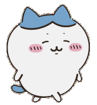
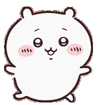
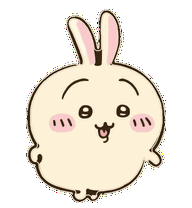
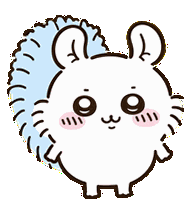

<div align="center">

  <!-- Animated Mascot Header -->
  
  
  

  <br/><br/>

  <!-- Dynamic Typing SVG Banner (No Emojis) -->
  <a href="https://github.com/itspallyourfren">
    
  </a>

  <p align="center">
    <i>何とかなれッ! — (Nantoka Nare!)</i><br/>
    <b>Coding with good vibes, daily consistency, and smiling through bugs.</b>
  </p>

  <!-- Clean Minimalist Badges (No Emojis) -->
  <p align="center">
    
    
    
  </p>

</div>

---

### Text Art & Copypasta Corner

```text
       (\_/)                                      /\_/\
      ( •.• )   わァ…… 泣いちゃった...             ( •̀.• )   何とかなれーッ!!
     c(   c )   (Wah... yaa...)                  c(   c )   (NANTOKA NARE!)
       w w                                        w w
   [ CHIIKAWA ]                              [ HACHIWARE ]
   Junior Developer                          Senior Mentor
   (Tries his absolute best)                 (Optimistic Problem Solver)

             (\__/)
             ( •o• )   YAHA!! URRRAAA!!
            c(   c )   (Speed Coding at 3 AM)
               w w
           [ USAGI ]
           Chaos Engineer
```

```text
          #    @@@@###########@@@.   *          
          @.   **.            ..*   .@          
        @#*.                        .*#@        
      @#.                              .*@      
    @#.                                   *@    
   @.        .**.          .***            .@   
  @.         ..              ..             .@  
 @.         .#**#.         ##*##             .@ 
 #          @@*#@#        .@#*@@.             # 
@#     .... .###*.         *#*#* ......       #@
 #   .*#*#*#.      *.##.*.     .*#*#*#*.      # 
 @.   .***.*.      ******.     ..*.*.*..     .@ 
  @.                 ..                     .@  
   @*                                      *@   
    @#*.                                 *#@    
      @.                                 #      
     @*.*                             *. .@     
     @*.#                             ## *@     
      @#@.                             ##@      
         #                            .@        
          #.                         *@         
           @#*                     *#@          
              @#  .*..........  *#@             
               @. #@ @@@@@@@@# .@               
                ##@          @##                
                [ (՞ ̫ ՞) CHIIKAWA ]
```

---

### About Me

```yaml
developer:
  name: "Faal Jundy"
  github: "@itspallyourfren"
  focus: ["Web Development", "AI Agents", "Creative Automation"]
  streak_policy: "100% green contributions, 365 days a year"
  philosophy: "Simplicity is prerequisite for reliability."
```

---

### The Squad

<div align="center">

| Character | Role | Signature Quote |
| :---: | :--- | :---: |
| <br/><b>Chiikawa</b> | <b>Dedicated Junior</b><br/>Always giving 100% effort, never gives up despite tough errors. | <i>"Wah... yaa..."</i> |
| <br/><b>Hachiware</b> | <b>Senior Mentor</b><br/>Optimistic partner who believes every bug has an elegant fix. | <i>"Nantoka Nare!"</i> |
| <br/><b>Usagi</b> | <b>Chaos 10x Engineer</b><br/>Deploys straight to production with supersonic speed. | <i>"Yaha! Uraaa!"</i> |
| <br/><b>Momonga</b> | <b>Design Specialist</b><br/>Demands maximum cuteness and perfect UI aesthetic. | <i>"Praise me more!"</i> |

</div>

---

### Tech Stack

<div align="center">

| Category | Tools |
| :--- | :--- |
| **Languages** |      |
| **Frontend** |   |
| **Tools & Cloud** |     |

</div>

---

### GitHub Streak & Activity

<div align="center">

  
  

</div>

---

<div align="center">

  <i>"Consistency is the DNA of mastery."</i><br/><br/>
  

</div>
