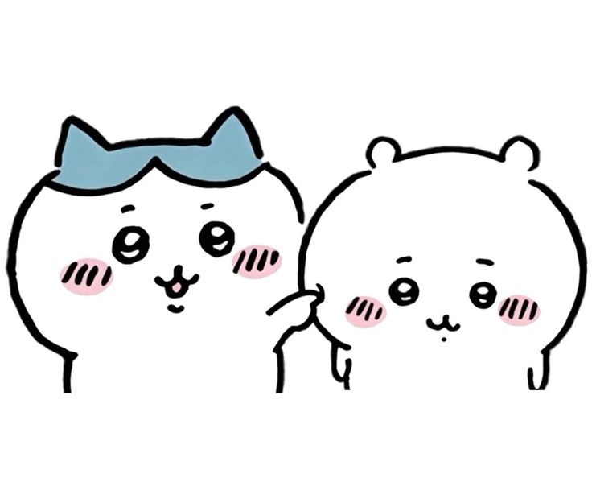

<div align="center">

  <!-- Cute Header Mascot -->
  

  <br/><br/>

  <!-- Dynamic Typing SVG Banner -->
  <a href="https://github.com/itspallyourfren">
    
  </a>

  <p align="center">
    <i>🐾 <b>"何とかなれッ!" — (Nantoka Nare!)</b> 🐾</i><br/>
    <b>Coding with good vibes, keeping streaks bright green, and smiling through bugs with Chiikawa & friends!</b>
  </p>

  <!-- Cute Mini Badges -->
  <p align="center">
    
    
    
  </p>

</div>

---

### 🌸 About Me ( ˶•̀ᴗ•́˶ )

```yaml
user:
  name: "Faal Jundy"
  handle: "@itspallyourfren"
  passion: "Web Development, AI Experimentation, & Creative Coding"
  daily_fuel: "Coffee ☕ + Lo-fi Beats 🎧 + Chiikawa Clips 🐾"
  current_goal: "Never break the GitHub streak (100% Green Mode 🟩)"
  favorite_quote: "Small daily improvements over time lead to stunning results."
```

---

### 🐱 Chiikawa & Friends Developer Squad

<div align="center">

| Mascot | Archetype & Personality | Motto |
| :---: | :--- | :---: |
| <br/><b>Chiikawa</b> | **The Dedicated Junior**<br/><i>Pekerja keras, pemalu, walau suka gugup kalau ada error tapi pantang menyerah sampai fix!</i> | *"Wah... Yaa...!"* 🥺🤍 |
| <br/><b>Hachiware</b> | **The Senior Mentor**<br/><i>Sahabat terbaik yang selalu optimis, suka eksplorasi tech baru, dan jago problem solving.</i> | *"Nantoka Nare!"* 🐱💙 |
| 🐰<br/><b>Usagi</b> | **The 10x Chaos Engineer**<br/><i>Coding dengan kecepatan suara, tanpa mikir panjang langsung push ke production!</i> | *"Yaha! Uraaa!"* ⚡🥕 |

</div>

---

### 🛠️ Tech Stack & Skills

<div align="center">

| Category | Technologies |
| :--- | :--- |
| **Languages** |      |
| **Frontend & UI** |    |
| **Backend & Tools** |      |

</div>

---

### 📊 GitHub Activity & Streak Telemetry

<div align="center">

  
  

</div>

<br/>

<div align="center">
  
</div>

---

<div align="center">

  <p><b>(づ๑•ᴗ•๑)づ Terima kasih sudah mampir ke profilku!</b></p>
  <i>Mari berteman, berkolaborasi, dan saling support! ✨</i><br/><br/>

  

</div>
