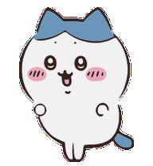
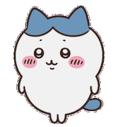
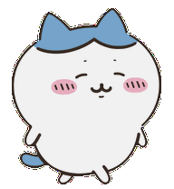
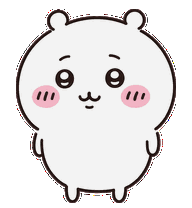
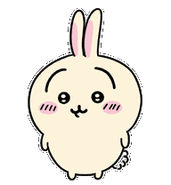
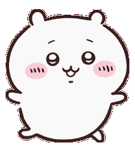
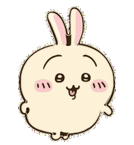

<div align="center">

  <!-- Hachiware Main Mascot Header (Animated) -->
  
  
  

  <br/><br/>

  <!-- Dynamic Typing SVG Banner (Hachiware Blue Theme, No Emojis) -->
  <a href="https://github.com/itspallyourfren">
    
  </a>

  <p align="center">
    <i>何とかなれッ! — (Nantoka Nare!)</i><br/>
    <b>A curious psychology student finding beauty in human minds, happy vibes, and creative coding.</b>
  </p>

  <!-- Clean Minimalist Blue Badges (No Emojis) -->
  <p align="center">
    
    
    
    
  </p>

</div>

---

### Copypasta & Text Art Corner

```text
       /\_/\                                        (\_/)
      ( •̀.• )   何とかなれーッ!!                     ( •.• )   わァ…… 泣いちゃった...
     c(   c )   (NANTOKA NARE!)                    c(   c )   (Wah... yaa...)
       w w                                           w w
   [ HACHIWARE ]                                 [ CHIIKAWA ]
   The Blue Soul & Persona                       The Gentle Heart
   "Tenang aja, semua overthinking               "Nangis dulu gapapa, semua emosi
   dan masalah pasti bisa diatasi!"              itu wajar dan valid untuk dirasakan."

                           (\__/)
                           ( •o• )   YAHA!! URRRAAA!!
                          c(   c )   (Pure Spontaneous Energy)
                             w w
                         [ USAGI ]
                         The Dopamine Booster
                         "Lepaskan overthinking, gaspol tanpa ragu!"
```

```text
            #**#             #@@*             
           #@@@@@#  ###### #@@@@@#            
          #@@@@@@@@@@@@@@@@@@@@@@@#           
          #@@@@@@@@@@@@@@@@@@@@@@@*           
        #*@@@@@@@@*...*@@@@@@@@@@@..*#        
       #. .......       .........    .*       
      #                                #      
     #.      ....      ...*.           .#     
     #.      ***#      .#*#.           .#     
     #.  ..*....  ...    . ..*...      .#     
      *  .....    ....     ......      *      
       *                             .*       
       #.                            .#       
       *                              *       
       *.*                         * .#       
        ##*                       .###        
           *.                    .*@@@@#      
            #*..              ..**@@@@@#      
               #*...     ....*#   ###         
                   #. *  #                    
                    #* **                     
            [ (՞ ̫ ՞) HACHIWARE BLUE ]
```

---

### About Me

```yaml
student:
  name: "Faal Jundy"
  handle: "@itspallyourfren"
  major: "Psychology (Psikologi)"
  interests:
    - "Human Behavior & Cognitive Psychology"
    - "Emotional Resilience & Well-being"
    - "Human-AI Interaction & Creative Exploration"
    - "Coffee, Lo-fi music, and reading notes"
  tech_hobby: "Automating fun stuff, data curiosity, & daily GitHub streak"
  life_motto: "Nantoka Nare! (Everything has a way of working out)"
```

---

### The Trio Squad (Psychology Edition)

<div align="center">

| Character | Role & Psychology Archetype | Mascot Quote |
| :---: | :--- | :---: |
| <br/><b>Hachiware (Blue)</b><br/><i>Persona Utama</i> | <b>Positive Psychology & Resilience</b><br/>Paling suportif, gemar membaca dan belajar, selalu membangkitkan semangat saat keadaan sedang berat. | <i>"Nantoka Nare!"</i> |
| <br/><b>Chiikawa</b><br/><i>Sahabat Setia</i> | <b>Empathy & Vulnerability</b><br/>Mengingatkan kita bahwa merasa takut dan sensitif itu manusiawi. Tetap berusaha sekuat tenaga walau perlahan. | <i>"Wah... yaa..."</i> |
| <br/><b>Usagi</b><br/><i>Mood Maker</i> | <b>Spontaneous Dopamine & Freedom</b><br/>Sosok tanpa filter yang hidup di momen sekarang. Obat mujarab untuk mengatasi kecemasan dan overthinking! | <i>"Yaha! Uraaa!"</i> |

</div>

---

### Creative Tools & Tech for Fun

<div align="center">

| Area | Tools & Platforms |
| :--- | :--- |
| **Learning & Research** |   |
| **Creative Code** |    |
| **Workflow** |     |

</div>

---

### Activity & Streak Telemetry

<div align="center">

  
  

</div>

---

<div align="center">

  <!-- Trio Running Together Animated Footer -->
  
  
  

  <br/><br/>
  <i>"Small daily steps and a kind heart create wonderful journeys."</i><br/>
  <b>Senang bertemu denganmu! Mari saling berbagi energi positif dan berteman baik.</b><br/><br/>

  

</div>
